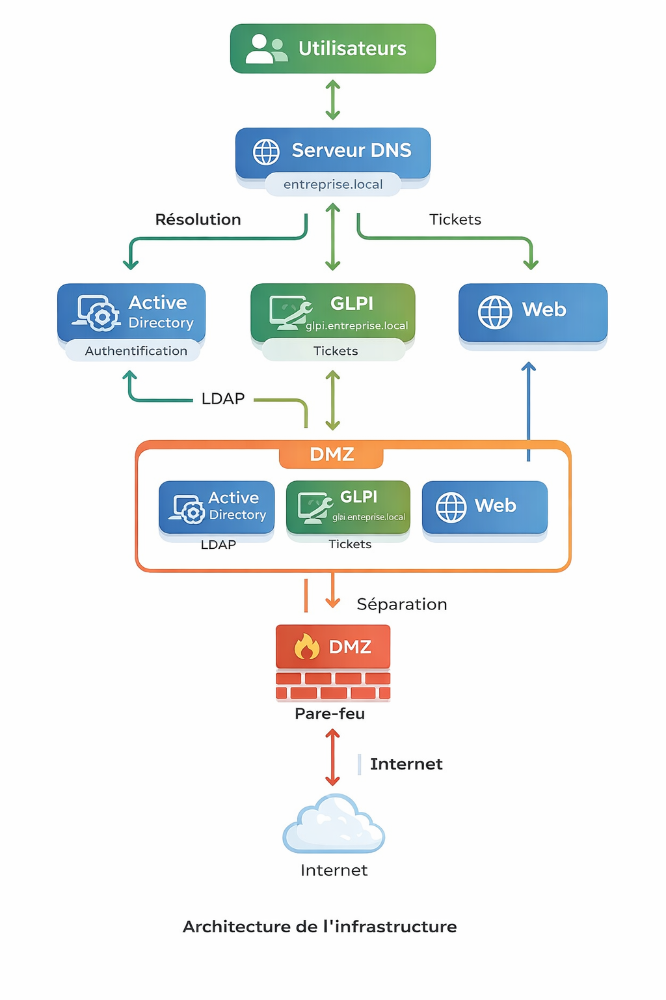

# 🖥️ Projet Infrastructure IT – Mini Entreprise

## 📌 Présentation

Ce projet consiste en la mise en place d’une infrastructure IT simulant une entreprise, avec plusieurs services interconnectés :

- Active Directory (gestion des utilisateurs et authentification)
- DNS (résolution des noms et communication réseau)
- GLPI (gestion de parc et support IT)

L’objectif est de comprendre le fonctionnement global d’un système d’information et l’interaction entre ses différents composants.

---

## 🧱 Architecture

L’infrastructure repose sur un environnement structuré avec :

- Un domaine Active Directory
- Un service DNS
- Une plateforme GLPI intégrée via LDAP
- Une séparation réseau (DMZ / pare-feu)

📷 Schéma :

---

## ⚙️ Projets détaillés

### 🔐 Active Directory
Gestion du domaine, des utilisateurs et des politiques de sécurité  
👉 [Voir le projet](active-directory/ad.pdf)

---

### 🌐 DNS
Service de résolution de noms intégré à l’infrastructure  
👉 [Voir le projet](dns/dns.pdf)

---

### 🖥️ GLPI
Gestion de parc, support IT et intégration LDAP  
👉 [Voir le projet](glpi/glpi.pdf)

---

## 🚧 État du projet

Ce projet a été réalisé dans le cadre d’une simulation d’infrastructure IT.

L’environnement initial n’étant plus disponible, certaines parties ne peuvent pas être redéployées immédiatement.

Cependant, la structure du projet, les choix techniques et la documentation restent représentatifs du travail réalisé.

Une amélioration et une reconstruction complète de l’infrastructure sont prévues à l’avenir.

---

## 🎯 Objectif professionnel

Ce projet s’inscrit dans mon objectif de développer des compétences en systèmes, réseaux et gestion d’infrastructures IT.

À long terme, je souhaite évoluer vers des projets techniques en administration systèmes et réseaux, avec l’ambition de proposer des solutions concrètes en entreprise.

---

## 🔗 Portfolio

👉 [Voir mon portfolio](https://github.com/emir-moutassiev/portfolio-it)

---

## 📬 Contact

- Email : ton mail
  
